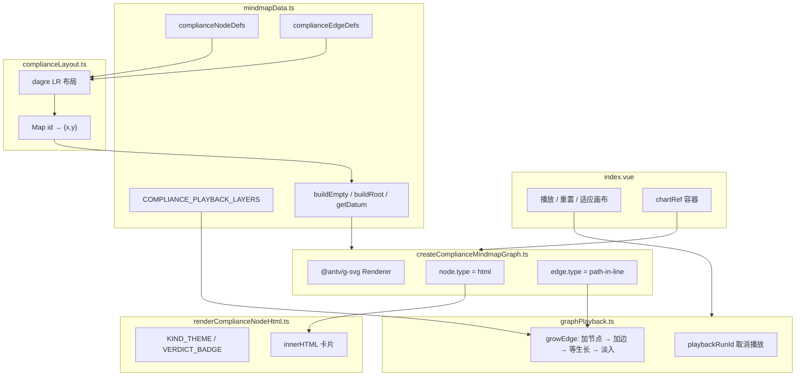

# 合规分析思维导图实现说明

本文档说明 `compliance-mindmap` 模块如何用 [AntV G6 v5](https://g6.antv.antgroup.com/) + [dagre](https://github.com/dagrejs/dagre) + HTML 自定义节点，实现「合规分析链路」的从左到右思维导图，包括数据模型、预计算布局、HTML 卡片样式、自定义连线生长动画，以及分层播放生成。

适合作为 G6 教学示例阅读：从「空画布」到「边生长 → 节点淡入」，再到「适应画布」。

## 快速体验

1. 启动项目：`npm run dev`
2. 打开路由：`/compliance-mindmap`
3. 点击 **播放生成**，观察四层逐步展开（结论节点由三条线同时汇入）
4. 可用 **重置** 清空画布，用 **适应画布** 把整图收进视口

依赖要点：

| 包 | 用途 |
| --- | --- |
| `@antv/g6` | 图引擎、HTML 节点、行为（拖拽 / 缩放） |
| `@antv/g-svg` | SVG 渲染器（连线等矢量层） |
| `@dagrejs/dagre` | 离线计算 LR 层级布局坐标 |

## 目录结构

```
compliance-mindmap/
├── index.vue                        # 页面：工具栏、画布容器、生命周期
├── mindmapData.ts                   # 节点/边定义、尺寸、播放分镜、图数据工厂
├── complianceLayout.ts              # dagre 预计算坐标
├── createComplianceMindmapGraph.ts  # 创建 G6 Graph（SVG + HTML 节点）
├── renderComplianceNodeHtml.ts      # HTML 卡片模板与主题 token
├── pathInLine.ts                    # 自定义边：path-in 生长动画
├── graphPlayback.ts                 # 播放 / 重置 / 适应画布
└── README.md                        # 本文档
```

路由：`/compliance-mindmap`（`src/router/index.ts`）

## 整体架构



页面在 `onMounted` 时调用 `createComplianceMindmapGraph(container)` 创建空图；`ResizeObserver` 负责容器自适应；卸载时 `graph.destroy()` 释放资源。

## 业务场景

以**待核验材料（根节点）**为起点，从左向右展开合规审查链路：

```text
资质证书.docx
  → 综合管理要求 → 业务背景
      → 政策依据（采购 / 数据安全 / 工程）×3
          → 合同分析 ×3
              → 合规判定建议 ×3
                  → 最终结论
```

节点类型与含义：

| kind | 含义 | 典型内容 |
| --- | --- | --- |
| `file` | 起始材料 | 文件名 |
| `section` | 摘要 / 背景 | 多行说明 |
| `policy` | 政策依据 | `•` 列表 |
| `analysis-blue` / `analysis-yellow` | 合同分析 | 正文 + 判定徽章 |
| `advice` | 判定建议 | 正文 + 判定徽章 |
| `conclusion` | 最终结论 | 正文 + 判定徽章 |

判定枚举 `ComplianceVerdict`：

- `compliant`：合规（绿）
- `suspected`：疑似违规（橙）
- `violation`：违规（红）

## 数据模型

### 节点载荷

```ts
interface MindmapNodePayload {
  kind: MindmapNodeKind
  title: string
  content?: string
  subtitle?: string
  verdict?: ComplianceVerdict
}
```

G6 侧节点结构：

```ts
{
  id: 'summary',
  data: { kind: 'section', title: '...', content: '...' },
  style: { x, y /* 来自 dagre 预计算 */ }
}
```

### 边

边 id 统一用 `complianceEdgeId(source, target)` → `` `${source}__${target}` ``，便于播放时幂等判断 `graph.hasEdge(edgeId)`。

端口约定（水平从左到右）：

- `sourcePort: 'right'`
- `targetPort: 'left'`

### 节点尺寸

尺寸写在 `NODE_SIZE`，同时供 **dagre 占位** 与 **HTML 节点 `size`** 使用，必须一致，否则连线端口会对不齐卡片。

```ts
file: [184, 68]
section: [280, 190]
policy: [280, 192]
// ...
```

### 图数据工厂

| 函数 | 作用 |
| --- | --- |
| `buildEmptyGraphData()` | 初始 / 重置：空画布，无任何节点 |
| `buildRootGraphData(layout)` | 播放开始：只放 `root` |
| `getComplianceNodeDatum(id, layout)` | 按 id 取节点 + 坐标 |
| `getComplianceEdgeDatum(source, target)` | 取边数据 |

## 布局：为什么用 dagre 预计算

本示例**不用 G6 内置 layout**，而是在创建图之前用 dagre 算好每个节点的 `(x, y)`：

```ts
graph.setGraph({ rankdir: 'LR', nodesep: 52, ranksep: 112 })
```

原因：

1. **播放时逐步加节点**，若边加边布局，坐标会跳动
2. 预计算后，每次 `addNodeData` 直接写入固定坐标，动画只做「出现」，不做「位移」
3. 布局逻辑与渲染解耦，便于单独调试节点间距

`setComplianceLayout(layout)` 把结果缓存到 `graphPlayback` 模块，播放过程中通过 `getComplianceLayout()` 读取。

## 创建图：SVG + HTML 节点

核心在 `createComplianceMindmapGraph.ts`。

### SVG 渲染器

```ts
import { Renderer as SVGRenderer } from '@antv/g-svg'

renderer: () => new SVGRenderer()
```

G6 v5 默认是 Canvas；这里显式切到 SVG，连线等图形走矢量层。

> 注意：`node.type = 'html'` 时，**节点内容仍是 DOM**，挂在 G6 的 HTML overlay 上。SVG 主要影响边与底层图形，不会把 HTML 卡片变成矢量文字。

### HTML 节点

```ts
node: {
  type: 'html',
  style: {
    size: (d) => getNodeSize(getPayload(d).kind),
    dx: (d) => -width / 2,   // HTML 以左上为原点，需偏移到中心
    dy: (d) => -height / 2,
    ports: [
      { key: 'left', placement: [0, 0.5] },
      { key: 'right', placement: [1, 0.5] },
    ],
    innerHTML: (d) => renderComplianceNodeHtml(getPayload(d), d.id),
  },
}
```

要点：

1. **`dx` / `dy`**：G6 HTML 节点默认左上角对齐坐标点，必须减去半宽半高，才能与 dagre 中心点对齐
2. **`innerHTML`**：返回字符串；样式用 inline style，避免全局 CSS 污染
3. **`data-node-id`**：写在卡片根元素上，播放时用 `querySelector` 控制淡入
4. **卡片必须写死像素宽高**：外层容器不会把 `size` 作为 CSS 高度传下来，`height:100%` 会塌陷成内容高度，导致卡片可见中心偏离端口（连线接在偏下位置）；模板里直接用 `NODE_SIZE` 写 `width/height` 像素值，内容用 flex 垂直居中

### 行为

```ts
behaviors: [
  'drag-canvas',
  { type: 'zoom-canvas', sensitivity: 0.12, animation: false },
]
```

初始 `data` 为 `buildEmptyGraphData()`，页面打开时**不显示任何节点**。

## HTML 卡片样式

`renderComplianceNodeHtml.ts` 按 `kind` 取主题 token，拼出卡片 HTML：

- 左侧贯穿的渐变 accent 竖条（`conclusion` 跟随判定色）
- 标题 / 正文 / 圆点列表（列表标记用 accent 色）
- 可选判定徽章（合规 / 疑似违规 / 违规，带状态圆点）
- `file` 类型带文档图标，边框更粗、阴影偏蓝
- 卡片背景为白到主题色的纵向微渐变，阴影三层叠加更柔和

设计取舍（与封面图风格对齐，同时保证可读性）：

- 去掉 `backdrop-filter`（毛玻璃会导致发虚）
- 背景改为接近不透明的实色
- 根节点单独强化阴影与字重

XSS 防护：文案经 `escapeHtml` 后再插入模板。

## 自定义边：path-in 生长动画

文件：`pathInLine.ts`。

继承 `CubicHorizontal`（水平三次贝塞尔），注册为 `path-in-line`：

```ts
register(ExtensionCategory.EDGE, 'path-in-line', PathInLine)
```

`onCreate` 时：

1. 取路径总长 `L`
2. 设 `lineDash = [0, L]`（整段不可见）
3. 动画到 `lineDash = [L, 0]`（整段画出）
4. 结束后改回业务点线 `[1, 7]`（配合 `lineCap: 'round'` 呈圆点效果）

时长常量：`EDGE_GROW_DURATION_MS = 1200`，播放逻辑必须与此对齐，否则节点会在线还没画完时提前出现。

## 播放生成（核心时序）

文件：`graphPlayback.ts`。

### 分镜

`COMPLIANCE_PLAYBACK_LAYERS` 把边分成四层：

1. **主干**：root → summary → business  
2. **政策**：business → 三个 policy  
3. **分析 / 建议**：沿三条分支推进到 advice  
4. **结论（edge-group）**：等所有节点淡入完毕后，三条 advice → conclusion 的边**同时生长**，全部长完再统一显示 conclusion  

层内步间隔 `STEP_GAP_MS = 80`，层间间隔 `LAYER_GAP_MS = 360`，节点淡入时长 `NODE_FADE_MS = 280`。

### 单步 `growEdge`

正确时序（避免「节点先闪一下」）：

```text
1. 若 target 不在图中 → addNodeData(target)   // 供边计算端点
2. addEdgeData(source → target)
3. await graph.draw()                         // 触发 PathInLine.onCreate
4. 立刻把 [data-node-id] 的 opacity 设为 0    // HTML 不受 G6 opacity 可靠控制
5. await delay(EDGE_GROW_DURATION_MS)         // 等线长完
6. opacity → 1 + CSS transition 淡入
```

为什么不能只靠 `style.opacity: 0`？

- HTML 节点的 DOM 在 `draw()` 过程中就会挂上
- G6 对 HTML 的 opacity 同步有时序差，会出现「先可见再隐藏」的闪烁
- 因此用卡片自己的 `opacity` + `transition: none` 立即压住，再淡入

### 取消播放

用递增的 `playbackRunId`：每次重置 / 重新播放时 `+1`，循环里发现 runId 不匹配就中止，避免旧动画继续往图上加节点。

### 适应画布

`fitComplianceMindmapView`：

1. `graph.fitView({ when: 'always' })`
2. 若缩放倍率 `> 1`，`zoomTo(1)`，避免 HTML 被过度放大

播放**开始时不再**对单节点 `fitView`，否则空画布 → 只有 root 时会出现「突然放大」的跳变。

## 页面交互

`index.vue` 职责尽量薄：

| 操作 | 行为 |
| --- | --- |
| 播放生成 | `playComplianceGraphGeneration(graph, chartRef)` |
| 重置 | `resetComplianceGraphPlayback` → 空图 |
| 适应画布 | `fitComplianceMindmapView` |
| 容器尺寸变化 | `graph.resize(w, h)` |
| 卸载 | `graph.destroy()` |

播放中禁用「播放 / 重置」，防止并发改图。

## 关键设计决策

### 1. 空画布起步

初始与重置都是空图；只有点击播放才出现 root，再按分镜生长。  
演示感更强，也避免打开页面就看到静态半成品。

### 2. 布局与播放分离

布局一次算完，播放只增删数据。  
若改成「边播边 layout」，节点会飞移，不适合「生成」叙事。

### 3. HTML 节点的利弊

| 优点 | 代价 |
| --- | --- |
| 富文本、徽章、图标易做 | 缩放靠 CSS `transform`，容易发虚 |
| 样式贴近产品 UI | 性能不如纯 Canvas/SVG 节点 |
| 可用 DOM 精确控制淡入 | 事件与全局 CSS 需注意隔离 |

官方说明：HTML（含 React）节点缩放通过 `transform` 实现，放大后模糊属于机制特性，不是单纯配置错误。

### 4. 不要用 `fix-element-size` 硬扛清晰度

`fix-element-size` 会在缩放时反向缩放节点，视觉上「节点不跟着变大」，与思维导图「整体缩放」预期冲突。本模块已明确不采用该方案。

## 如何扩展（练习建议）

1. **换业务数据**  
   改 `complianceNodeDefs` / `complianceEdgeDefs`，同步改 `layoutNodeDefs`、`COMPLIANCE_PLAYBACK_LAYERS` 与 `NODE_SIZE`。

2. **加快 / 减慢动画**  
   调 `EDGE_GROW_DURATION_MS`、`STEP_GAP_MS`、`LAYER_GAP_MS`；边长与等待必须同改。

3. **改卡片外观**  
   只动 `renderComplianceNodeHtml.ts` 的 `KIND_THEME` 与模板字符串。

4. **加交互**  
   在 HTML 里挂按钮时，事件需挂到 `window` 或事件委托，并 `stopPropagation`，避免抢画布拖拽。

5. **切回 Canvas 渲染**  
   去掉 `renderer: () => new SVGRenderer()` 即可回默认 Canvas；HTML 节点行为不变。

## 调试清单

- [ ] 节点位置偏了：检查 `dx/dy` 是否为半宽半高，以及 dagre 的 `width/height` 是否等于 `NODE_SIZE`
- [ ] 线长完节点才该出现，却提前闪：检查 `growEdge` 里是否在 `draw()` 后立刻 `opacity: 0`
- [ ] 播放一半点重置仍继续长：检查 `playbackRunId` 是否在重置时递增
- [ ] 打开页面就有节点：确认初始 data 是 `buildEmptyGraphData()`
- [ ] 第一帧突然放大：确认播放开始时没有对单节点 `fitView`

## 相关文件速查

| 想改… | 去这个文件 |
| --- | --- |
| 文案 / 拓扑 / 播放顺序 | `mindmapData.ts` |
| 节点间距 / 左右间距 | `complianceLayout.ts` |
| 卡片颜色与 DOM 结构 | `renderComplianceNodeHtml.ts` |
| 线颜色 / 虚线 / 生长时长 | `pathInLine.ts` + Graph edge style |
| 播放节奏 / 淡入逻辑 | `graphPlayback.ts` |
| 渲染器 / 缩放范围 / 行为 | `createComplianceMindmapGraph.ts` |
| 工具栏与页面样式 | `index.vue` |

## 参考链接

- [G6 HTML 节点](https://g6.antv.antgroup.com/manual/element/node/html)
- [G6 自定义元素 / register](https://g6.antv.antgroup.com/manual/element/node/custom-node)
- [G6 渲染器（Canvas / SVG / WebGL）](https://g6.antv.antgroup.com/manual/further-reading/renderer)
- [dagre 文档](https://github.com/dagrejs/dagre/wiki)
