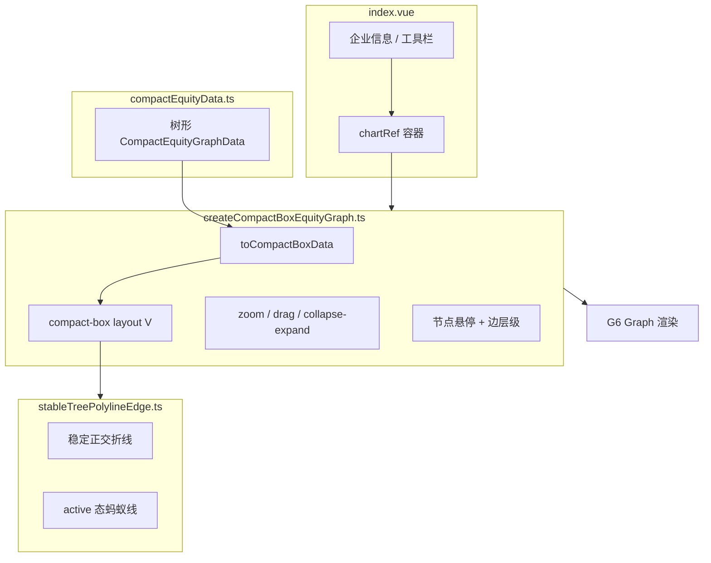

# CompactBox 股权穿透图实现说明

本文档说明 `equityCompactBox` 模块如何用 [AntV G6](https://g6.antv.antgroup.com/) 的 **compactBox** 布局实现上下方向的股权穿透树图，包括数据模型、布局转换、自定义边、折叠展开与悬停交互。

## 目录结构

```
equityCompactBox/
├── index.vue                      # 页面：企业信息 + 图表容器 + 工具栏
├── compactEquityData.ts             # 树形股权数据与公司元信息
├── createCompactBoxEquityGraph.ts   # G6 图实例创建与交互逻辑
├── stableTreePolylineEdge.ts        # 自定义边：稳定折线 + 蚂蚁线动画
└── README.md                        # 本文档
```

路由：`/equity-compact-box`（`src/router/index.ts`）

## 整体架构



页面在 `onMounted` 时调用 `createCompactBoxEquityGraph(container, compactEquityGraphData)` 创建图实例；`ResizeObserver` 与 `window.resize` 负责自适应容器尺寸；卸载时 `graph.destroy()` 释放资源。

## 数据模型

与 dagre 版的「节点 + 边」扁平结构不同，CompactBox 版使用 **单根树**：

```ts
interface CompactEquityNodeItem {
  id: string
  data: {
    name: string
    type?: 'person' | 'company' | 'target'  // 自然人 / 公司 / 穿透目标（境内主体）
    region?: string                          // 可选地区，展示为「名称\n(地区)」
  }
  children?: CompactEquityNodeItem[]
}

type CompactEquityGraphData = CompactEquityNodeItem  // 根节点即目标公司
```

示例数据中，根节点 `n-target`（星链科技）的 `children` 为股东层，股东可继续嵌套 `children` 表示上层持股关系。`compactCompanyInfo` 提供页面顶部的工商元信息，与图数据独立。

### 树 → 图数据转换

G6 布局需要 `nodes` + `edges`，通过内置 `treeToGraphData(tree)` 将树展开为图数据：

```ts
function toCompactBoxData(tree: CompactEquityGraphData) {
  const graphData = treeToGraphData(tree)
  graphData.edges = (graphData.edges ?? []).map((edge) => ({
    ...edge,
    sourcePort: 'bottom',  // 父节点从底边出
    targetPort: 'top',     // 子节点从顶边入
  }))
  return graphData
}
```

**要点**：compactBox 垂直布局（`direction: 'V'`）时，边应连接父节点底部与子节点顶部，否则端口默认可能导致连线方向不符合「上股东 → 下目标」的视觉习惯。

## 布局：compact-box

```ts
layout: {
  type: 'compact-box',
  direction: 'V',           // 垂直：股东在上，目标在下（根在布局中心/下方取决于数据方向）
  getId: (d) => String(d?.id ?? ''),
  getHeight: () => 56,        // NODE_HEIGHT
  getWidth: () => 200,        // NODE_WIDTH
  getVGap: () => 92,          // 层间距
  getHGap: () => 44,          // 同层节点间距
}
```

| 参数 | 值 | 作用 |
|------|-----|------|
| `NODE_WIDTH` / `NODE_HEIGHT` | 200 × 56 | 矩形节点尺寸 |
| `V_GAP` | 92 | 父子层级垂直间距 |
| `H_GAP` | 44 | 兄弟节点水平间距 |

compactBox 适合 **层次清晰、宽度可控** 的树形股权结构，相比 dagre 自动分层，子树在水平方向更紧凑地「装箱」排列。

## 节点样式与折叠按钮

### 视觉区分

| `type` | 填充 | 描边 | 标签色 | 语义 |
|--------|------|------|--------|------|
| `target` | `#1a5fb4` | `#1a5fb4` | 白 | 境内穿透目标主体 |
| 其他 | `#f5f9fd` | `#7eb2dd` | 深灰 | 股东 / 境外或中间主体 |

标签规则：`person` 只显示姓名；有 `region` 时显示 `名称\n(地区)`；否则仅名称。

### 端口

节点配置 `top` / `bottom` 两个 port，与边的 `sourcePort` / `targetPort` 配合。

### +/- 折叠徽章

有 `children` 的节点在底边居中显示圆形 **+**（已折叠）或 **−**（已展开）徽章，通过 G6 `badges` 配置：

```ts
function collapseExpandBadge(datum) {
  if (!hasCollapsibleChildren(datum)) return []
  const collapsed = !!datum.style?.collapsed
  return [{ text: collapsed ? '+' : '−', placement: 'bottom', offsetY: 10, ... }]
}
```

`collapse-expand` behavior 的 `enable` 回调 **仅当点击落在 badge 上** 时才触发折叠/展开（通过遍历 `event.originalTarget` 的 `className` 是否以 `badge-` 开头判断），避免误点节点本体触发展开。

## 交互行为（behaviors）

| 行为 | 配置 | 说明 |
|------|------|------|
| `zoom-canvas` | `sensitivity: 0.5` | 滚轮缩放 |
| `drag-canvas` | 默认 | 拖动画布 |
| `collapse-expand` | `trigger: 'click'`, `animation: true`, `align: true` | 点击 +/- 折叠子树；动画结束后对齐 |

工具栏（`index.vue`）：

- **全部展开** / **全部收起**：按深度排序后依次调用 `graph.expandElement` / `graph.collapseElement`
- **重置视图**：`setData` + `render` 恢复初始数据与布局

折叠/展开过程中通过 `graph.isCollapsingExpanding` 屏蔽悬停与高亮，避免动画期间状态错乱。

## 自定义边：stable-tree-polyline

文件：`stableTreePolylineEdge.ts`

### 为何自定义

默认折线在 **折叠/展开动画** 过程中若依赖动态 controlPoints，路径可能「乱跳」。本边类型继承 G6 `Polyline`，控制点 **仅由源、目标端点坐标计算**：

```ts
function stableTreeControlPoints(sourcePoint, targetPoint) {
  const midY = (sourcePoint[1] + targetPoint[1]) / 2
  return [
    [sourcePoint[0], midY],   // 竖线到中点高度
    [targetPoint[0], midY],   // 横线到目标 x
  ]
}
```

形态：**竖 → 横 → 竖** 的正交折线，适合垂直树。

边动画配置仅跟踪端点节点字段，折叠时随节点位置平滑更新：

```ts
animation: {
  collapse: [{ fields: ['sourceNode', 'targetNode'] }],
  expand: [{ fields: ['sourceNode', 'targetNode'] }],
  update: [{ fields: ['sourceNode', 'targetNode'] }],
}
```

### 悬停蚂蚁线

当边处于 `active` 状态时，在 keyShape 上循环播放 `lineDash` 偏移动画（`ANT_LINE_DASH = [6, 4]`）。折叠/展开期间调用 `stopAntAnimation()` 停止动画，避免与布局动画冲突。

注册方式（模块加载时执行一次）：

```ts
register(ExtensionCategory.EDGE, 'stable-tree-polyline', StableTreePolyline)
```

## 悬停高亮系统

由 `createNodeHoverController` 与 `createEdgeHoverLayerController` 协作实现。

### 节点悬停（`active` 状态）

鼠标进入节点（且不在 badge 上）时：

1. 当前节点、所有关联边、关联邻居节点加入 `active` 状态
2. 非关联边 `zIndex` 降低（`getBackgroundEdgeZIndex`），关联边在 `active` 态略抬高（`getActiveEdgeZIndex`）
3. `syncAllStableTreePolylineEdges` 启动关联边的蚂蚁线

离开节点或点击 badge 时清除 `active` 并恢复边层级。

**zIndex 策略**（相对端点节点）：

| 场景 | 相对层级 |
|------|----------|
| 默认边 | `max(源, 目标) - 1` |
| active 边 | `max - 0.5` |
| 背景弱化边 | `max - 2` |

边层级始终 **低于节点**，避免遮住 +/- 按钮。

### 与 collapse-expand 的协调

- 折叠/展开开始：`nodeHoverController.endHover(true)` 强制结束悬停
- `isGraphCollapsingExpanding(graph)` 为 true 时，跳过高亮与 zIndex 更新

## 与 dagre 版（`/equity`）的差异

| 维度 | dagre 版 | CompactBox 版 |
|------|----------|---------------|
| 数据 | `nodes[]` + `edges[]`，含持股比例 | 单根 `children` 树 |
| 布局 | `antv-dagre`，`rankdir: 'TB'` | `compact-box`，`direction: 'V'` |
| 折叠 | 无 | +/- 徽章 + collapse-expand |
| 悬停 | G6 内置 `hover-activate` | 自研节点/边层级 + 蚂蚁线 |
| 边类型 | `hover-ant-polyline` + orth router | `stable-tree-polyline`，端点定控制点 |
| 视图 | `autoFit: 'view'` | 手动 resize，无 autoFit |

两套实现节点配色与业务语义一致，但 CompactBox 版更适合 **可折叠的多层股东树** 产品形态。

## 扩展与接入建议

1. **对接 API**：将接口返回转为 `CompactEquityNodeItem` 树；若后端给扁平列表，需先 `buildTree(parentId)` 再传入。
2. **持股比例**：可在 `data` 上增加 `percent`，在 `formatLabel` 或边 `labelText` 中展示。
3. **默认折叠深度**：`render` 后对指定 `depth` 的节点调用 `collapseElement`。
4. **性能**：节点数百以内 compactBox + 自定义边表现良好；更大图可考虑虚拟化或按层懒加载 `children`。

## 关键 API 速查

```ts
// 创建
createCompactBoxEquityGraph(container: HTMLElement, data: CompactEquityGraphData): G6Graph

// 重置数据
resetCompactBoxEquityGraph(graph, data): Promise<void>

// 批量折叠/展开
collapseAllCompactBoxNodes(graph): Promise<void>
expandAllCompactBoxNodes(graph): Promise<void>
```

## 本地预览

```bash
npm run dev
# 浏览器打开 http://localhost:5173/equity-compact-box
```

首页「精选项目」卡片入口指向同一路由。
